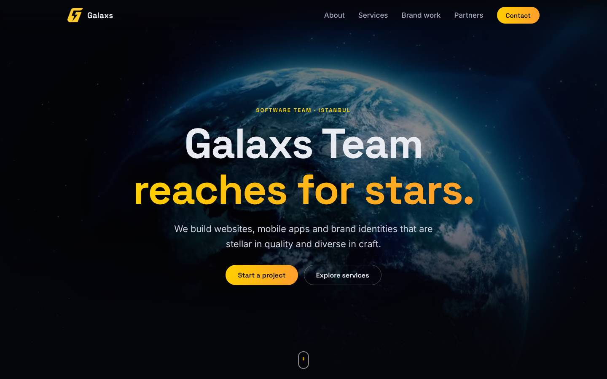
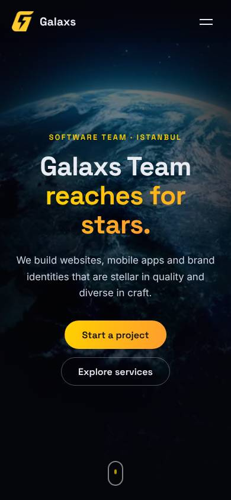

# Galaxs Team

A fast, responsive, dependency-free website for **Galaxs Team**, a software and design team based in Beşiktaş, Istanbul. It presents the team's services, brand work and partners, with a space-themed video hero in a gold-on-black identity.

**Live demo:** https://mohammedszd.github.io/galaxy-site/

<p align="center">
  
</p>
<p align="center">
  
</p>

## Overview

A single-page site with these sections:

- **Hero**: looping video background with calls to action
- **About**: who Galaxs is
- **Services**: web, mobile, logo, graphic and motion design, video editing, digital art
- **Brand work**: logo and identity samples
- **Partners**: partner logos
- **Contact**: email and location

## Features

- Responsive layout designed for mobile first, with a slide-down mobile menu
- Scroll-reveal animations that respect `prefers-reduced-motion` (the hero video also stays paused)
- Accessible markup: skip link, visible focus states, alt text, semantic landmarks
- SEO metadata, Open Graph / Twitter cards, JSON-LD, `robots.txt` and `sitemap.xml`
- No tracking and no third-party requests

## Technologies

Plain HTML, CSS and JavaScript. Self-hosted fonts (Space Grotesk, Inter). No frameworks, libraries or build step.

## Performance

- Hero video reduced from 32 MB (4K) to about 1.8 MB (1280px, WebM and MP4 with a poster image)
- Images converted to cropped WebP and lazy-loaded with explicit dimensions
- Self-hosted, preloaded display font and `font-display: swap`
- About 20 small static files in total

## Run locally

```sh
git clone https://github.com/MohammedSZD/galaxy-site.git
cd galaxy-site
python3 -m http.server 8080 -d public
```

Then open http://localhost:8080.

## Deployment

The `public/` directory is the deployable site. `.github/workflows/pages.yml` publishes it to GitHub Pages on every push to `master` that changes `public/`. In the repository settings, set **Pages → Source** to **GitHub Actions**.

## Repository layout

- `public/`: the current website
- `docs/screenshots/`: screenshots used in this README
- Files at the repository root (`index.html`, `style.css`, `img/`, videos): the original version, kept for reference

## Asset rights

The hero video, logo samples and partner logos belong to their respective owners. Reuse requires their permission.
